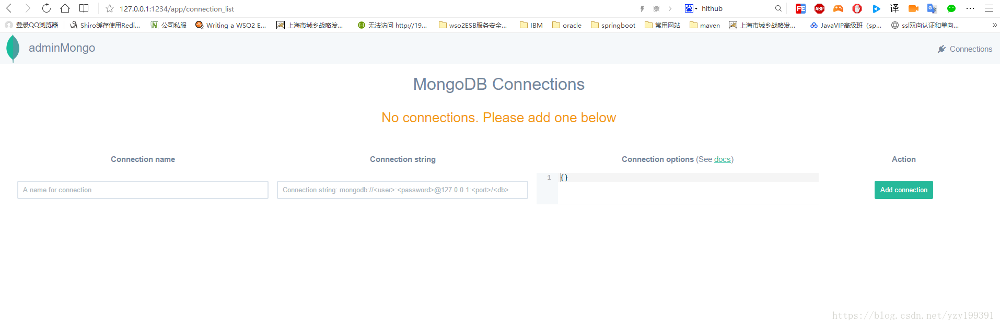

# mongo可视化工具adminMongo安装

git下将adminMongo源码从github上clone下来：

```
git clone https://github.com/mrvautin/adminMongo.git
```

进入adminMongo路径：

```
cd adminMongo
```

安装依赖：

```
npm install
```

启动应用：

```
npm start或者node app
```

打开浏览器，输入 `http://127.0.0.1:1234` 就可以看到adminMongo的界面了！

